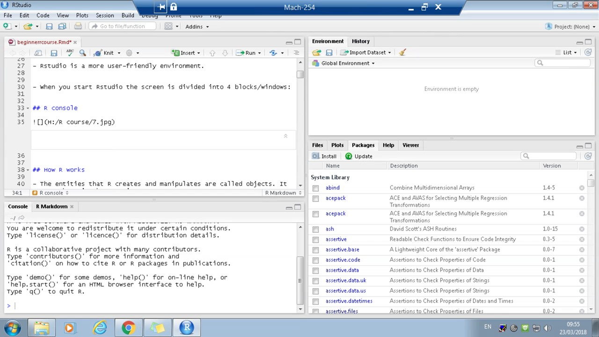
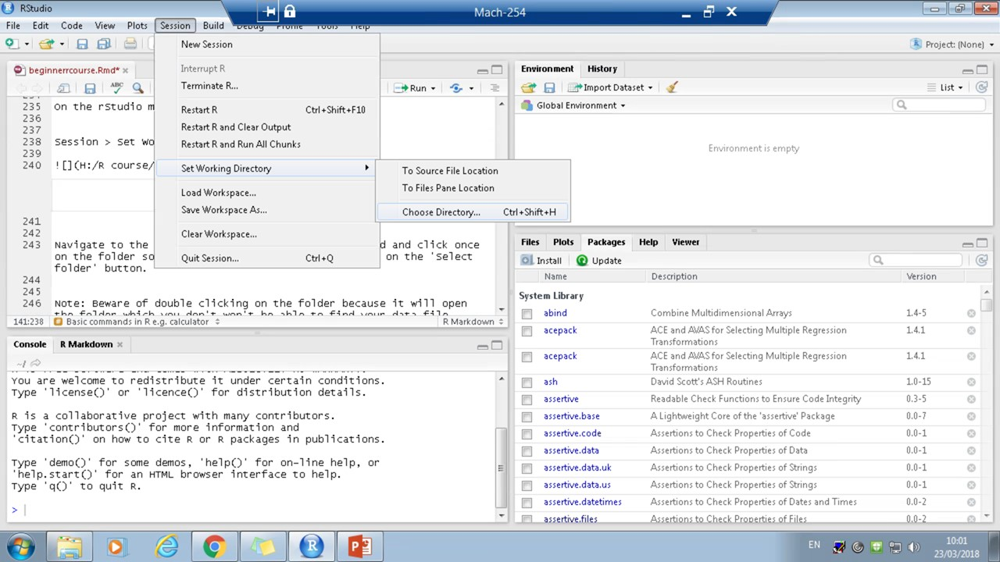
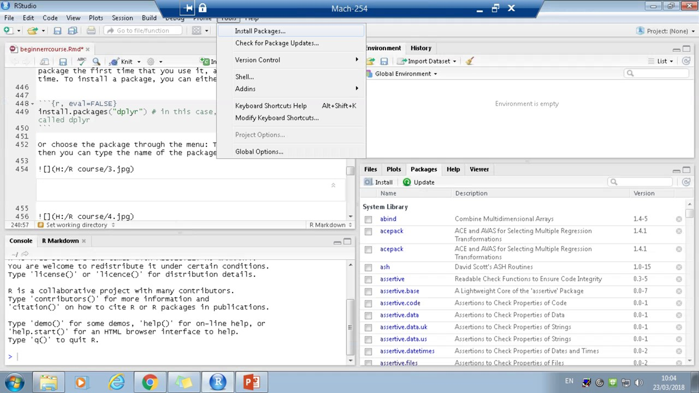
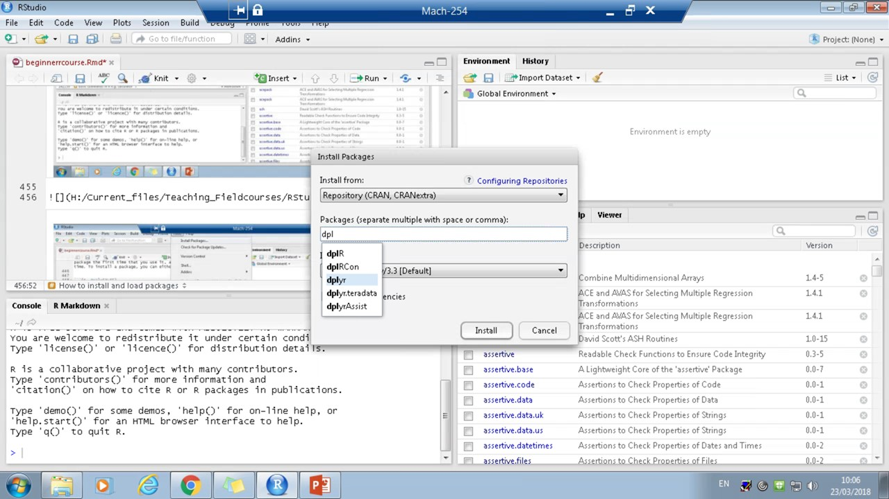

```{r setup, include=FALSE}
knitr::opts_chunk$set(echo = TRUE)
library(knitr)
```

## Introduction to the workshop

- Who we are 

- The aim of the session 

- What the session involves 


## What is R?

- R is free statistical program 
- It uses a computer language called S
- You type in commands to get the computer to do things, rather than point and click like in programs like excel. 
- It's open sourced (anyone can make new packages to provide new functions)
- People have created packages to deal with lots of different problems/analyses.
- But, people might have written functions in different ways for different packages

## What does R look like? 

- Two main programs:'R' and 'Rstudio'. 


- Rstudio is a more user-friendly environment.


- When you start Rstudio the screen is divided into 4 blocks/windows:


## R console




## How R works

- The entities that R creates and manipulates are called objects. It stores these in the R environment. 
- R recognises each object by the name is it's given, which can be made up of alphabetic characters and numbers. 
- R is case-sensitive so fish and Fish are two different objects. 
- Few symbols are allowed apart from '_' and '.'
- Object names can't start with a number of '_' and it's advisable not to use '.' either 

## How R works (2)


- Avoid some single letter object names because R sometimes also uses them. 
- Avoid object names that can be functions in R e.g. data. 
- You can create objects using '<-' which is R's version of '='


```{r}
mut <- 3+ 4
```

- There are different data types in R and the type of data an object is can affect how R 'deals' with it.

## Data types in R: Vector

- A collection of different elements which can hold different types of data 

### Numeric vector  

```{r}
a <- c(1,2,5.3,6,-2,4) 
a
str(a)
```

### Character vector

```{r}
b <- c("one","two","three") 
b
str(b)
```

### Logical vector

```{r}
c <- c(TRUE,TRUE,TRUE,FALSE,TRUE,FALSE) 
c
str(c)
```


## Data types in R: Matrix

- A vector with added dimensions (must have columns and rows). All columns must have the same mode and length 

```{r}
y<-matrix(1:20, nrow=5,ncol=4)   # generates 5 x 4 numeric matrix 
y
str(y)
```

## Data types in R: Matrix (2)

```{r}
s_means = matrix(c(-14, -15.1, -11.03, 3.06, 7.05, 13.72), ncol=2, nrow=3)
s_means
str(s_means)
```

## Data types in R: Data frame

- They are more general than a matrix and can have columns which have different modes. 

```{r}
dat <- data.frame(id = letters[1:3], x = 1:3, y = 4:6)
dat
str(dat)
```

## Data types in R: List

An ordered collection of objects and they can have different modes in one list

```{r}
w <- list(name="Fred", mynumbers=a, mymatrix=y, age=5.3)
str(w)
```

## Data types in R: Factor

You can tell R that a variable is nominal (used for identification/labelling) by making it a factor. 

```{r}
x <- factor(c("yes", "no", "no", "yes", "yes"))
x
str(x)
```


## Basic commands in R e.g. calculator 


Open up Rstudio. 

Have a look at the different windows in R and try to understand what each window is used for. If you don't have the top left window (R script) then you can click on the button with the blank page with the green/white plus which brings up the menu as shown below and you can click on R script and it will open a new script. 


Once you are happy navigating the different windows, in the bottom left hand window (the console) try typing the following (in grey) and press enter after each line when you want an output. The output that should come up is shown in white boxes.


You can use R as a simple calculator:

```{r}
3 + 4
```


Create an object called foo: 

```{r}
foo<- 3 + 4
```


You should see this object appear under your 'values' tab in your environment. See what foo looks like: 

```{r}
foo
```


Create another object called po: 

```{r}
po<- 8+ 5
```


See what po looks like: 

```{r}
po
```


Add foo and po together and create a new object, zu:

```{r}
zu<- foo + po
```


See what zu looks like:

```{r}
zu
```


See what the structure of zu looks like:

```{r}
str(zu)
```


You can also overwrite objects: 

```{r}
zu<- "hello"
```


Now see what zu looks like:

```{r}
str(zu)
```


## Set working directory 


If you want to import an excel file with your data in, rather than typing it in by hand or export an output to a folder, you need to tell R where to look. You do this by setting the working directory. But before you do this you need to create a new folder and download and save the example data file in this new folder.  


First of all create a new folder called 'Rsession' in your main drive (I call this H:, but it could be C: or any other letter!). 


There are two different ways to set the working directory: 


1.Use the main menu to navigate to the right folder


On the rStudio main menu click on: 


Session > Set Working Directory > Choose Directory 




Navigate to the Rsession folder you have just created and click once on the folder so its highlighted in blue, then click on the 'Select folder' button. 


Note: Beware of double clicking on the folder because it will open the folder which you don't won't be able to find your data file. 


You can check you have the right folder set as your working directory by doing: 

```{r, eval=FALSE}
getwd()
```


You should see:"H:/Rsession"


2. You can tell R to set the working directory using the command setwd()


On the top left hand window (in your Rscript) type: 

```{r, eval=FALSE}
setwd('D:/Teaching_Fieldcourses')
```


Be aware that you need to type the exact file path otherwise R won't be able to understand it, if you want to know the file path you can also go to windows explorer, find your folder and click once on the file path bar on the top of the window and it will show the file path. Just be careful if you copy this you need to change the backslashes ('\') to forward slashes ('/').


### Read in data 


Note: R likes using .csv files rather than normal excel spreadsheets (.xlsx files). So please save the files you want to import into R as .csv files.

Also make sure they are tidy (e.g. data in two columns with no breaks, you can have titles for columns) and don't have random plots, writing etc. otherwise R won't know how to interpret it. 


We will practice loading data into R now. Let's get a nice opensource data file from GitHub. You need to put in the following command to get the dataset:

```{r, eval=FALSE}
install.packages("devtools")
devtools::install_github("allisonhorst/palmerpenguins")
library(palmerpenguins)

```


Copy the following file into Excel:


```{r, echo = FALSE}
p <- head(palmerpenguins::penguins, 10)
kable(p)
```


Now save the file in the Rsession folder you created. Call it testdata and save it as type CSV (Comma delimited).


To read in your file you use the function read.csv in R:

```{r, eval=FALSE}
mydata<-read.csv("testdata.csv") 
# here the file will be called mydata in R, and as the working directory will be the folder in which your data file is saved, R will find it there
```


You can also save files back into your working directory with the function write.csv, if you have changed them in R:

```{r, eval=FALSE}
write.csv(mydata, "testdatanew.csv") 
# the first bit in the bracket is the name of the file in R, the second bit is the name of the new csv file you want to save
```


## Some basic outputs from a dataset

Apart from the str function, there are some other functions we can use to get an initial idea of our data. We can use the function mean to calculate the mean of some values:

```{r}
mean(c(5,7,9))
```


We can summarise each column. For continuous variables, this will show the minimum and maximum value, the quartiles and the mean. For nominal variables, it will show the different categories and a count of each one. We will use a built-in dataset called iris:

```{r}
penguins<-palmerpenguins::penguins
summary(penguins)
```


We can also get the summary for just one variable. We need to tell R in which dataset to look for it, and then add the column name after a dollar sign:

```{r}
summary(penguins$bill_depth_mm)

mean(penguins$bill_depth_mm)
```


To get a better idea of your dataset, you can also use the head function, which will show the first 6 rows of the dataset, unless otherwise specified in the code:

```{r}
head(penguins)

head(penguins, 10) 
# this will show the first 10 rows
```


The same works for the last 6 rows with the tail function:

```{r}
tail(penguins)

tail(penguins, 10)
```


## Changing the type of variable

If variables are not in the right format, it can mess up our analysis or our plots, as R might deal differently with different types of variables. Sometimes R does not read the variables in the right way, or we need to change the variable type for some reason. Once we have checked whether our variables are in the correct format, we can change those that are not:

```{r}
penguins$species<-as.character(penguins$species)

# we can check what type of variable we have in different ways:
str(penguins$species)
is.character(penguins$species)
```


In this case, species should really be a factor, so we will change it back to that:

```{r}
penguins$species<-as.factor(penguins$species)
```


In the same way, we can change variables to integers (as.integer) or continuous variables (as.numeric).


## Basic plots

Now we have some idea of what our data are, we can start to make plots to see whether our variables interact in some way. The function is called plot and is very simple. If we have two continuous variables, we will get a scatter plot:

```{r}
plot(x=penguins$bill_length_mm, y=penguins$bill_depth_mm)
```


We can change axis labels by changing xlab and ylab in the brackets:

```{r}
plot(x=iris$Sepal.Length, y=iris$Petal.Length, xlab="Sepal length", ylab="Petal length")
```


We can change the colour of the circles depending on the species:

```{r}
plot(x=penguins$bill_length_mm, y=penguins$bill_depth_mm, xlab="Bill length", ylab="Bill depth", col=penguins$species)
```


If we have one ordinal variable (species) and one continuous variable (bill_length_mm), we will get a boxplot:

```{r}
plot(x=penguins$species, y=penguins$bill_length_mm)
```


We can also make histograms using the hist function:

```{r}
hist(penguins$bill_length_mm)
```


We can completely customise the plots. The benefit of making plots in R is that we can use the same colours, font etc for all of them by just changing the variable names in our code. This means you can standardise how your plots will look in your final PhD thesis very easily.

To save the plots, we need to set up the type of file first, run the plot commands, and then save it:

```{r}
jpeg('rplot.jpg')

plot(x=penguins$species, y=penguins$bill_length_mm)

dev.off()
```


The plots will be saved in the folder that you set in the working directory. We can also save plots as pdfs:

```{r}
pdf('rplot.pdf')

plot(x=penguins$species, y=penguins$bill_length_mm)

dev.off()
```


## How to install and load packages

R has a huge library of additional packages. At some point you will most likely need to use some of these packages - they might be able to run some analyses which will save you from writing lots of code, contain some datasets that are of interest to you, or help with organising or displaying your data, for example. Some packages are very specific and will only be of interest to a few, whereas others are widely used. For a full list see https://cran.r-project.org/web/packages/available_packages_by_name.html

As with all programmes on your computer, you need to install a package the first time that you use it, and load it every following time. To install a package, you can either use the code


```{r, eval=FALSE}
install.packages("dplyr") # in this case, we are installing a package called dplyr
```

Or choose the package through the menu: Tools > Install packages., then you can type the name of the package.






Once you have installed your package, you can load it.

```{r}
library(dplyr)
```


#### Every time you start R, you will have to load the package again if you want to use a function in that package!


To find out about all the different functions in a package, you can usually find a detailed description of all functions in a package (called vignette) online, just google "R package packagename". For dplyr, this will get you the following pdf: https://cran.r-project.org/web/packages/dplyr/dplyr.pdf

dplyr is a useful package for manipulating data. We will use a dataset called airquality for some basic functions with dplyr. Some of the easiest to use functions in the package are filter and select.

filter will retain or remove rows in your dataset, according to conditions you set:

```{r}
temphigh<-filter(airquality, Temp>79) 
# this creates a new dataset called temphigh, which are all values from dataset airquality where temperature is above 79

templow<-filter(airquality, Temp<=79) 
# this creates a new dataset called temphigh, which are all values from dataset airquality where temperature is below or at 79
```


We can also examine rows that contain NA values, or exclude rows that contain NA values:

```{r}
summary(airquality) 
# Ozone contains 37 rows with NA values

airqualityNA<-filter(airquality, is.na(Ozone)) 
# In this case we keep those rows where Ozone is NA

summary(airqualityNA)

airqualitynoNA<-filter(airquality, !is.na(Ozone)) 
# Often we might want to remove NAs from our dataset, not keep them - we do this by adding ! in front of is.na. Here we keep rows if Ozone is not NA

summary(airqualitynoNA)
```


The select function can be used to include or exclude columns from the dataset:

```{r}
airquality2<-select(airquality, -Ozone) 
# this will make a new dataset called airquality2, based on airquality, without the variable Ozone

str(airquality2)

airquality3<-select(airquality, Ozone, Solar.R) 
# this will make a new dataset called airquality3, based on airquality, with only the variables Ozone and Solar.R

str(airquality3)
```


## Saving R files

It is important to save your code - if you find a mistake in your dataset, or your supervisor wants you to run some analysis again, it will be much quicker to do if you have your code saved.

It is up to you how you organise your code - for example, you could have a script for each chapter of your PhD. It is always a good idea to annotate what you do, so if you come back to your code at a later date you know what you were doing:

```{r}
# if you add a hash, R won't read what you write after it until the next line. This way you can annotate your code
```


To save your R script, go to File > Save as. and then find the folder that you want to save your script in. You can also save your code in text files, but be careful with using Word: it formats some symbols in a way that R then cannot read!


## Solving problems in R/ help

Sometimes it is difficult to know how exactly you need to write your code for a certain function, and you might get error messages. These can be difficult to interpret, especially if you are new to R. You can get more information on how to set up your code within a function by finding an R help file:

```{r, eval=FALSE}
?summary
# this will tell you more about the summary function
```


The help files are very useful, and the more you use R, the better you will understand them. Often it is easiest to look at the example code at the end.


## Useful resources


### Workshops

Intermediate R session: We are running a session on 22nd November to introduce you to more advanced techniques in R such as Rmarkdown,  for loops, if else statements and functions.

Data visualization in R: We are running a session on 29th November to introduce you in more detail about how to display different types of variables, and more details about how to customise your plot using the ggplot2 package.


### Online

There is lots of information online about all kinds of R related problems, tutorials and so on. Here are a few that are particularly useful if you are new to R:

The book R for data science covers starting points on how to arrange your data, data visualisation, programming and model building in R.

R bloggers - each post covers a topic with some example code. This can be handy if you have a specific R-related problem, want to know some basic information about a new package you are using, etc.

www.swirlstats.com Learn R, in R - this is an interactive tool with different modules that teach R within an R package.

stackoverflow - On this forum people can post R-related questions, and more experienced users help to find solutions. The examples provided in the questions need to be reproducible however. Often the questions you may have will already have been asked and answered on stackoverflow, so it is worth checking whether you can find a solution already.


### Checklist

Other than those helpful resources here is a checklist of what to do if you are stuck with a problem in R:


* First of all don't panic or get frustrated! Everyone will have a problem at some point in time if they are learning something new 


* Have a sanity check and look for obvious wrong things e.g. spelling mistakes, an object isn't in your data environment, you haven't called library() before using a package.  


* Google it! There is somewhat an art to wording your question in google to get the type of answers you are looking for but this will get better with practise. (And googling error messages never gets you very far). Chances are someone else will have definitely faced the same problem as you, even if it's not exactly in the same format and the answer is somewhere on the internet. 


* Can you find an example of what you want where it works? Even if it's a simpler example understanding the basics of it might help you work out what's wrong.  Have a close look at that example, what exactly the data they used was, what format it was etc. 


* Ask a friend ! They might have faced the same problem as you (although maybe don't do this every 10 minutes as they might start to get annoyed and also working out a problem helps your understanding too). 


* Sometimes it's just better to walk away (for now). If you have been struggling for a couple of hours it's sometimes really good to just walk away from it and start again another day when you have a fresh pair of eyes (and hopefully some renewed patience). Or even just going for a small walk can help you get some clarity on the problem. 


* If you really can't suss it ask a question on stack overflow (which can be quite intimidating as you need to follow certain rules e.g. have a small chunk of data which is reproducible) or supervisor/lecturer/someone very knowledgeable !  


* People trying to help you, particularly when it's someone that can't sit with you and actually see your computer (i.e. someone on the internet) often find it useful to have a reproducible example, creating one of these in itself can be quite challenging but have a look at the 'reprex' package, it helps you you create a reproducible example snippet of your code which might help you to better understand your error/ problem and will help those people trying to help you
